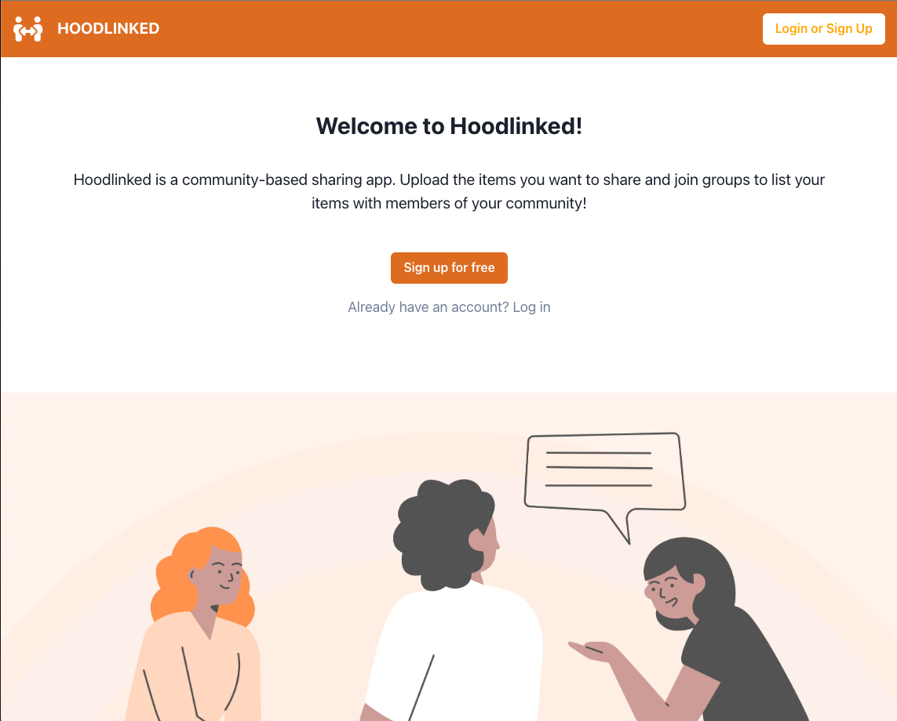

# Hoodlinked

  ## Description
  Hoodlinked is a community-based sharing app. Upload the items you want to share and join groups to list your items with members of your community!

  ## Table of Contents
  * [Usage](#usage)
  * [License](#license)
  * [Questions](#questions)

  ## Getting Started

  Access the deployed app here: 
  [Hoodlinked](https://hoodlinked.herokuapp.com/)

  ## Usage

  ### App Functionality

  Upon visiting the website for the first time, the user is presented with the homepage, which includes the option to log in, sign up, and a brief overview of Hoodlinked. If a user has previously created an account, they may sign in. Otherwise, a new account can be made using the forms.

  

  

  

  Creating an account/signing in will redirect the user to their dashboard where a user can see their Groups and Items.

  

  

  A user may also visit the Groups page to view all current groups and browse them.

  

  A user can create new Groups and Items.

  
  
  
  Or they can search through already existing.
  
  
  
  

  ## License
  MIT

  ## Credits

  Genevieve Mladenka: [GitHub](https://github.com/genmla)

  Nara Kim: [GitHub](https://github.com/mintedd)

  Jaya Singh: [GitHub](https://github.com/jaya4ever)

  Jennifer Arboleda: [GitHub](https://github.com/internetjen)
